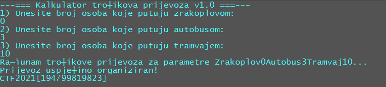

# Trip Calculation

> Category: Binary Exploitation

> Points: 120

## Challenge Description

> translated: Laura and her friends every year visit a place outside of Croatia. Since this year it's coronavirus time, they have decided to make a short trip to Zagreb. As they don't live in Zagreb, and have a limited budget they decided to use a program for calculating trip expenses. Some of her friends would go by plane, some by train and others by bus.
> You can use the program if you want to organize a trip with your friends as well. The program has a few limitation, which at first aren't easy to avoid, but it always calculates the trip expenses successfully. You are given the source code of the program too, and a Linux executable so you could study the program and analyse it. It will help in your career further as a programmer, and maybe somewhere else too :)

> native: Laura i njezini prijatelji svake godine putuju u neko mjesto izvan Hrvatske. Budući da ove godine vlada koronavirus, odlučili su napraviti kratki izlet u Zagreb. Kako ne žive svi u Zagrebu, a imaju ograničeni budžet, odlučili su koristiti program za izračun troškova prijevoza koji će im olakšati komplicirane izračune. Neki od prijatelja bi išli tramvajem, neki avionom, a neki autobusom
> I ti možeš koristiti program ako odlučiš organizirati put s prijateljima. Program ima nekakvih ograničenja, koja nije baš na prvu lako zaobići, ali uvijek uspješno izračuna sve troškove. Dan ti je i izvorni kod programa te izvršna datoteka za Linux kako bi proučio program i analizirao ga. To će ti pomoći u budućoj karijeri ako želiš biti programer... ali možda ti još negdje može pomoći :)

## Analysis

So let's look at the source code we have here.

```c
#include <stdio.h>
#include <stdlib.h>
#include <stdint.h>

#define FLAG_PATH "flag"
#define FLAG_SIZE 200

#define BROJ_MAX 100

#define ZRAKOPLOV_CIJENA 310
#define AUTOBUS_CIJENA 150
#define TRAMVAJ_CIJENA 10
#define TRAMVAJ_MAX_CIJENA 100
#define BUDZET 550

void ispisi_rjesenje()
{
	FILE *file;
	char flag[FLAG_SIZE];

	file = fopen(FLAG_PATH, "r");

	fgets(flag, sizeof flag, file);

	fclose(file);

	printf("%s\r\n", flag);
}

int provjeri_parametre(unsigned long long int zrakoplov, unsigned long long int autobus, unsigned long long int tramvaj) {
	if (zrakoplov * ZRAKOPLOV_CIJENA == ZRAKOPLOV_CIJENA) {
		puts("Za kupnju avionske karte potrebne su barem dvije osobe!\r");
		return 0;
	}
	
	if (autobus * AUTOBUS_CIJENA == AUTOBUS_CIJENA) {
		puts("Za kupnju autobusne karte potrebne su barem dvije osobe!\r");
		return 0;
	}
	
	if (tramvaj * TRAMVAJ_CIJENA > TRAMVAJ_MAX_CIJENA) {
		puts("Premašen kapacitet tramvaja!\r");
		return 0;
	}
	
	if(zrakoplov < 0 || autobus < 0 || tramvaj < 0) {
		puts("Neispravan unos osoba!\r");
	}
	
	if (zrakoplov * ZRAKOPLOV_CIJENA + autobus * AUTOBUS_CIJENA + tramvaj * TRAMVAJ_CIJENA < BUDZET) {
		puts("Cijena ne premašuje budžet - unesite više osoba!\r");
		return 0;
	}

	if ((zrakoplov * ZRAKOPLOV_CIJENA + autobus * AUTOBUS_CIJENA + tramvaj * TRAMVAJ_CIJENA) > BUDZET) {
		puts("Cijena premašuje budžet!\r");
		return 0;
	}

	return 1;
}

int main()
{
	unsigned long long int zrakoplov, autobus, tramvaj;

	puts("---=== Kalkulator troškova prijevoza v1.0 ===---\r");
	puts("1) Unesite broj osoba koje putuju zrakoplovom:\r");
	fflush(stdout);

	scanf("%llu", &zrakoplov);
	
	puts("2) Unesite broj osoba koje putuju autobusom:\r");
	fflush(stdout);

	scanf("%llu", &autobus);
	
	puts("3) Unesite broj osoba koje putuju tramvajem:\r");
	fflush(stdout);

	scanf("%llu", &tramvaj);


	printf("Računam troškove prijevoza za parametre Zrakoplov%luAutobus%luTramvaj%lu...\r\n", zrakoplov, autobus, tramvaj);
	if (provjeri_parametre(zrakoplov, autobus, tramvaj)) {
		puts("Prijevoz uspješno organiziran!\r");
		ispisi_rjesenje();
	}

	fflush(stdout);
	getchar();

	return 0;
}
```

So we want to get to the `ispisi_rjesenje()` function, which means we need to pass all the tests in `provjeri_paramtere()` function.

The last two if-statements tell us that we need to meet our budget exactly.

So, with a little bit of maths we conclude that putting 3 people on the bus and 10 people on the train, we get exactly 550 in expenses, with everyone being able to buy a ticket.



## FLAG

> CTF2021[194799819823]