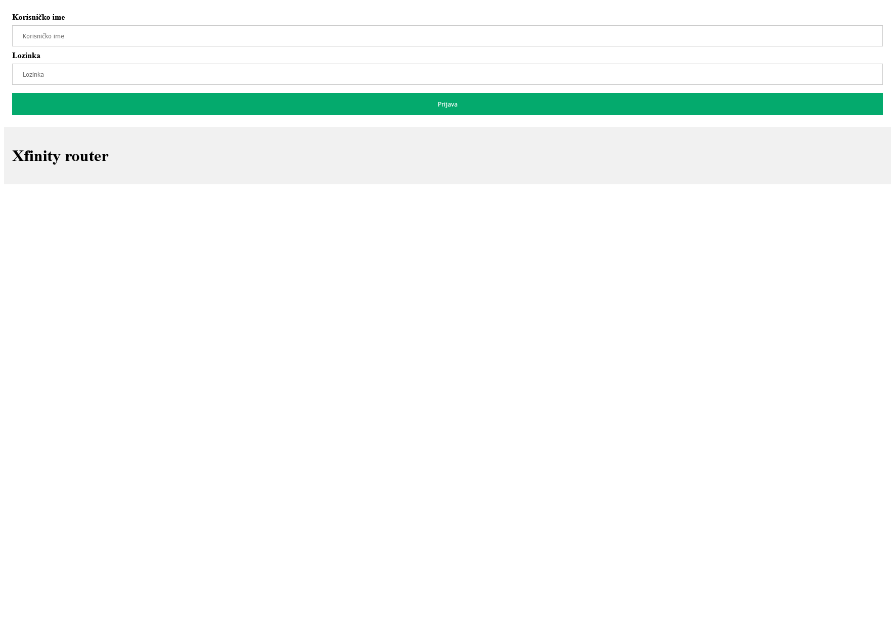

# Login

> Category: OSINT

> Points: 50

## Challenge Description

> translated: Lea decided to buy a new router. Sadly, she had forgotten her username and password. She says she didn't change that data ever since she bought the router, and she only remembers how the username had all the letters in caps. Help Lea find default user login access for the router.

> native: Lea je odlučila kupiti novi ruter. Međutim, zaboravila je korisničko ime i lozinku. Kaže kako te podatke nije mijenjala otkad je kupila ruter te da se jedino sjeća da je korisničko ime imalo sva slova velika. Pomozite Lei pronaći defaultne korisničke podatke za prijavu u ruter.

## Analysis

Visiting the page it says Xfinity router.

Googling `xfinity router default username password` we found this website: https://www.wisair.com/xfinity-router-login/

The site gives us two options for the login:

- Username: admin / Password: password

- Username: XFSET / Password: become

Since we know that the username is in all caps, we will try the second one and voila.

## FLAG

> CTF2021[794539237483]