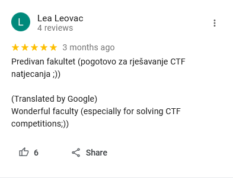
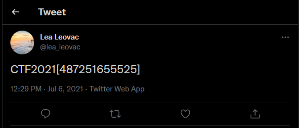

# Journey

> Category: OSINT

> Points: 50

## Challenge Description

> translated: Lea is a person that likes to travel and mark every place she visits. Also, if she likes the place, she always leaves a review on Google Maps. Lea also keeps all of her profiles on the internet public, which gives everyone access to her private information. Find the location on the map where this photo was taken which will help you in solving this task.

> native: Lea je osoba koja voli putovati te ovjekovječiti svako mjesto koje posjeti. Također, ako joj se mjesto svidi, obavezno ostavlja recenziju na Google Kartama. Međutim, Lea također sve svoje profile na Internetu drži javnima što neželjenim osobama omogućava pristup njezinim privatnim informacijama. Pronađite lokaciju na kojoj je slika uslikana koja će vam pomoći u rješavanju ovog zadatka.

## Analysis

We will use the site: https://tool.geoimgr.com/

After uploading the photo we get coordinates `45.800353882095,15.9713481112861`.

Inserting those into Google Maps we get a pinpoint on the FER university block.

Looking at FER reviews we find one by Lea:

We open up her profile, and find a picture of `SS. Annunziata di Firenze` which has some text written on it. It's a Twitter link.

If we type in that link in our browser (`https://twitter.com/regentcruises/status/1411671316185464836/photo/1`) we see a comment by Lea Leovac again.

On her profile we find the flag as a Twitter post (`https://twitter.com/lea_leovac/status/1412358101269893123`)

## FLAG

> CTF2021[487251655525]