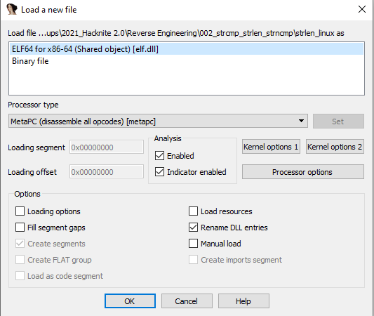
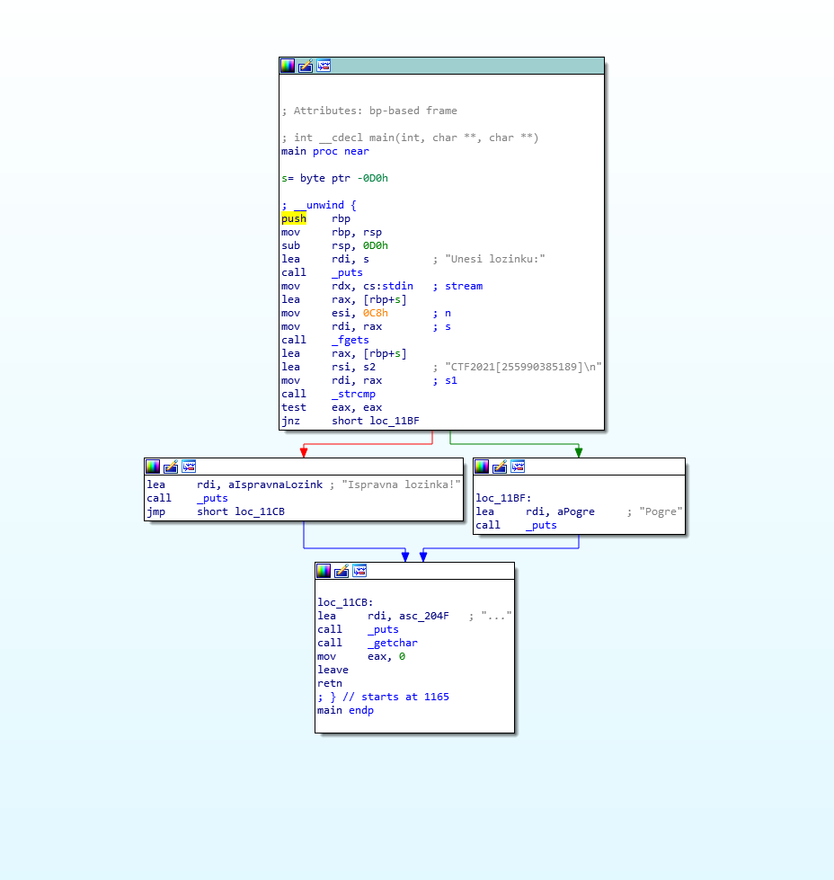

# Strcpm(), strlen(), strncmp()

> Category: Reverse Engineering

> Points: 50

## Challenge Description

> translated: Ema wanted to play a little bit with the ultimate question in life, universe and everything, so she wrote a program in C which asks for a secret number. And no, it's not 42. The solution is in the strings, but she isn't sure how to access the solution anymore.

> native: Ema je htjela još malo poigrati se sa ultimativnim pitanjem o životu, svemiru i svemu, te je napisala program u C-u koji traži tajni broj. I ne, 42 nije traženi tajni broj. U stringovima je zapisala rješenje, ali više nije sigurna kako pristupiti rješenju.

## Analysis

Let's run IDA and open the Linux file.

When we get into the Main section of the program we can see the flag in plaintext.

## FLAG

> CTF2021[255990385189]