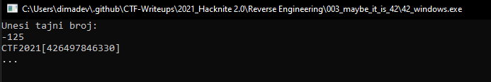

# Maybe it is 42?

> Category: Reverse Engineering

> Points: 100

## Challenge Description

> translated: 42 is the answer on the ultimate question about life, universe and everything. Unfortunately, not in the case of Ema's program. 42 isn't the correct answer, but Ema's favorite number is.

> native: 42 je odgovor na ultimativno pitanje o životu, svemiru i svemu. No nažalost, u slučaju programa kojeg je napisala Ema, 42 nije točan odgovor. Točan odgovor je Emin najdraži broj.

## Analysis

Let's run IDA and open the Linux file.

When we get into the Main section of the program we can't see the flag in plaintext anymore.

Unfortunately, I do not understand assembly. Fortunately, with IDA we can create a C file just by pressing CTRL + F5 keys.

That leaves us with this "main" code section.

```c
//----- (0000000000001155) ----------------------------------------------------
__int64 __fastcall main(__int64 a1, char **a2, char **a3)
{
  char v4; // [rsp+Fh] [rbp-31h]
  char s[32]; // [rsp+10h] [rbp-30h]
  _BYTE *v6; // [rsp+30h] [rbp-10h]
  __int64 i; // [rsp+38h] [rbp-8h]

  v6 = &unk_2004;
  puts("Unesi tajni broj:");
  __isoc99_scanf("%hhu", &v4);
  if ( v4 == -125 )
  {
    for ( i = 0LL; v6[i]; ++i )
      s[i] = v6[i] ^ v4;
    puts(s);
  }
  else
  {
    puts(aPogre);
  }
  puts("...");
  getchar();
  getchar();
  return 0LL;
}
// 1050: using guessed type __int64 __fastcall __isoc99_scanf(_QWORD, _QWORD);
// 1155: using guessed type char s[32];
```

We can see an obvious check of ```if (v4 == -125)```.

Let's input that in our program and voila.




## FLAG

> CTF2021[426497846330]