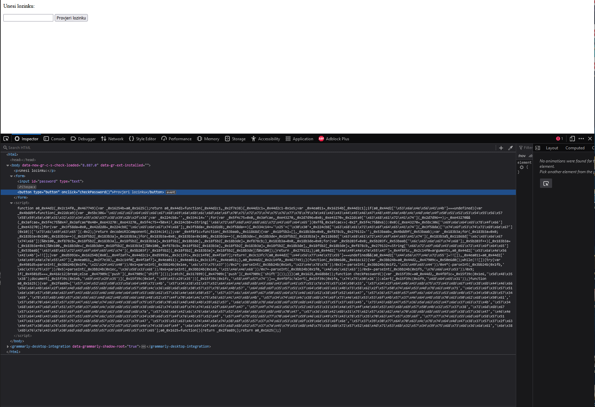
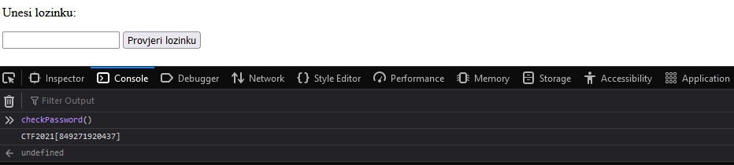

# j4v45CR1Pt 08fu5c4t0r

> Category: Reverse Engineering

> Points: 200

## Challenge Description

> translated: Ema wasn't content with the program she wrote in Python. This time she decided to make a website. Just like last time, the password which the website accepts is a combination of Ema's favorite numbers.

> native: Ema nije bila zadovoljna svojim programom kojeg je napisala u Pythonu. Zato je ovaj put odlučila napraviti web stranicu. Kao i prošli put, lozinka koju web stranica prihvaća je kombinacija Eminih najdražih brojeva.

## Analysis

When we visit the website we are greeted with an input form.

Opening inspect element we can see an inlined script.



Let's try to deobfuscate that code with a simple online tool: https://beautifier.io/

```js
function checkPassword() {
  var _0x15f39c = a0_0x44d2, _0x4f8f1c = _0x15f39c(486, "]H58");
  document[_0x15f39c(491, "iC)5")](_0x15f39c(495, "iC)5"))[_0x15f39c(508, "XOWt")] == _0x4f8f1c ? alert(_0x15f39c(506, "tu0&")) : alert(_0x15f39c(505, "hde1"));
}
```

There is a lot of code, but this is the most interesting thing here.

We can notice there is a ternary operator that causes the alerts. Let's modify the HTML a little bit and add in a simple console.log.

```js
function checkPassword() {
  var _0x15f39c = a0_0x44d2, _0x4f8f1c = _0x15f39c(486, "]H58");
  console.log(_0x4f8f1c);
  document[_0x15f39c(491, "iC)5")](_0x15f39c(495, "iC)5"))[_0x15f39c(508, "XOWt")] == _0x4f8f1c ? alert(_0x15f39c(506, "tu0&")) : alert(_0x15f39c(505, "hde1"));
}
```

We can put the fully beautified code in our new HTML, run it and in console run the ```checkPassword()``` function.

As an output we get the flag we need.



## FLAG

> CTF2021[849271920437]