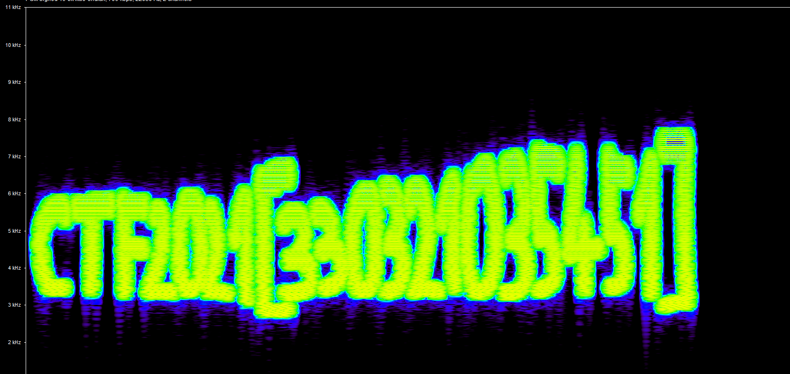

# Hitchcock's recording

> Category: Steganography

> Points: 40

## Challenge Description

> translated: Even the birds on the branch, in this recording know the solution to this task. But, are they truly birds or is it about something else?

> native: Čak i ptice na grani, odnosno u ovom zvučnom zapisu, znaju rješenje ovog zadatka. No, jesu li to uistinu ptice ili je riječ o nečem drugom?

## Analysis

Since we have a .waw file, we can use a tool like https://www.dcode.fr/spectral-analysis for the start.

Importing the .waw file there gives us the CTF flag printed out.

The solution looks a little bit like this:

## FLAG

> CTF2021[330321035451]