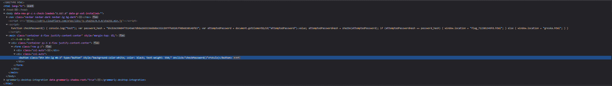
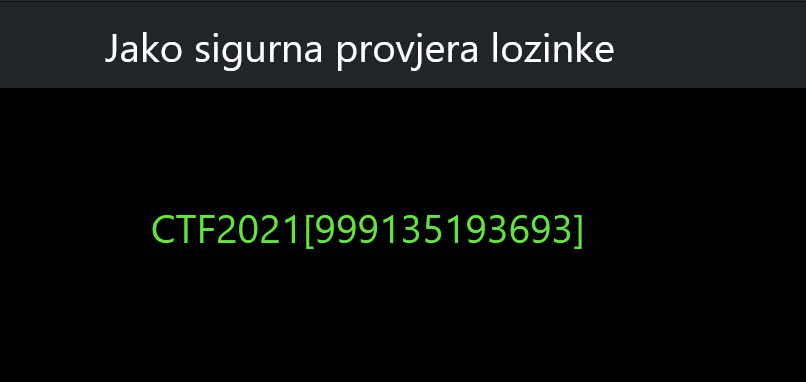

# The most secure password check

> Category: Web

> Points: 40

## Challenge Description

> (translated): Ivan has always wanted to know the best way if the inserted password is correct or not. After a long research session, he discovered a way he could do that. In that regard, he has created a very secure password and made a website so he could test his idea.

> (native): Ivan je oduvijek htio znati kako najbolje provjeriti je li upisana lozinka točna ili ne. Nakon dugo istraživanja, otkrio je na koji način bi to mogao napraviti. U tu svrhu, smislio je jednu jako dobru lozinku i napravio stranicu kako bi testirao tu svoju ideju. 

## Analysis

When we visit the website link, we get a simple looking form:

Upon using inspect element on the button, we can see in the HTML that it has a script inlined.

By reading the script we can see that it hashes the input, and compares it to the given hash. Afterwards, it throws us onto the "flag_712301349fd.html" website.

There are two ways here; one is using a hash solver to decrypt the hash and input the correct value, and the other is to just do /flag_712301349fd.html, for which we get the flag on the screen.

## FLAG

> CTF2021[999135193693]