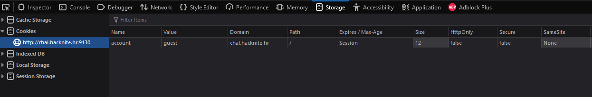

# Hidden Admin Content

> Category: Web

> Points: 50

## Challenge Description

> translated: Ana couldn't find a site secure enough to keep her data on. In the end she decided on creating a such website where the person has to be an administrator to see all of the contents of the website. She had discovered a way on how to login without any sign in forms or databases.

> native: Ana nije mogla naći dovoljno sigurnu stranicu na kojoj bi čuvala sve svoje podatke. Na kraju je odlučila sama napraviti takvu sigurnu stranicu gdje osoba mora biti administrator kako bi vidjela cijeli sadržaj stranice. Otkrila je način kako se uspješno prijaviti bez ikakve forme za prijavu ili baze podataka. 

## Analysis

Without even opening the website, this sounds like a low level cookie task.

Opening inspect element and going to the Storage tab, we find a cookie named "account" with a value of "guest".

Let's change that to admin, and open the flag website.

## FLAG

> CTF2021[215240044164]