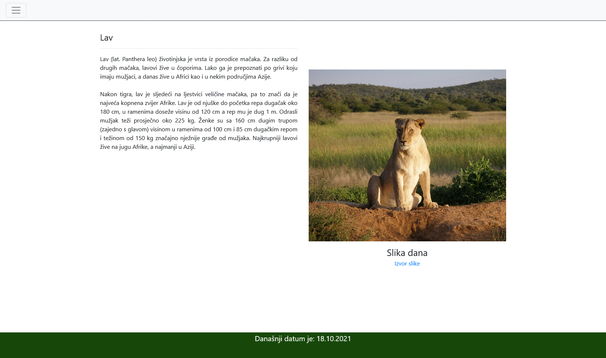
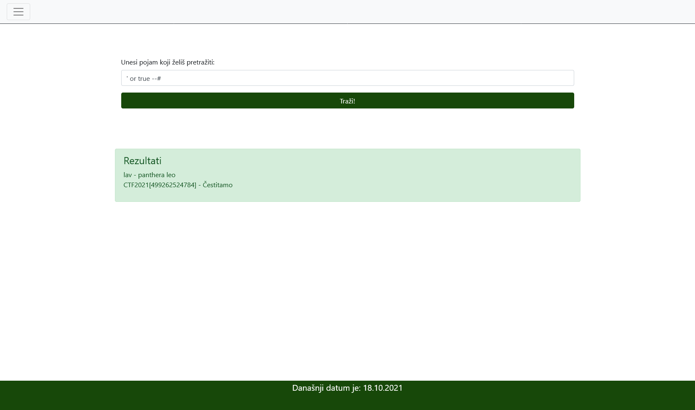

# Searching

> Category: Web

> Points: 70

## Challenge Description

> translated: Petra has to create her own website as a homework task for "Web pages". Since she is such an animal lover, she decided to make a website that contains interesting facts about wild animals such as lions, elephants or cheetahs. She chose a few animals, and decided to keep informations about them in a database. Till now, Petra has never worked with databases, so she made them the best she knew to. On her website she added the possibility of searching/querying different animals, and, even though she noticed that sometimes the search throws an error, it mostly works well.
> Petra is very proud of her website and she has decided to share it with you!

> native: Petra mora za zadatak iz predmeta "Web stranice" napraviti svoju vlastitu web stranicu. Budući da je velika ljubiteljica životinja, odlučila je napraviti stranicu koja sadrži zanimljive činjenice o divljim životinjama poput lava, slona ili geparda. Odabrala je par životinja, i odlučila je čuvati informacije o njima u bazi podataka. Do sada Petra nikad nije radila sa bazama podataka, pa ih je napravila najbolje kako zna. Na svojoj stranici je napravila mogućnost pretraživanja raznih životinja i, iako je primjetila da ponekad dolazi do greške, tražilica radi relativno dobro.
> Petra je jako ponosna na svoju stranicu i odlučila ju je podijeliti s tobom!

## Analysis

Upon visiting the website we get an interesting website. Navbar at the top shows we have a 'Search' page.

Upon submitting the query, it sends a request to the database and returns the data.

Doing simple SQL injections does the trick here; and any SQL injection cheat sheet will do. The SQL injection we used here is:

' or true --#

## FLAG

> CTF2021[499262524784]