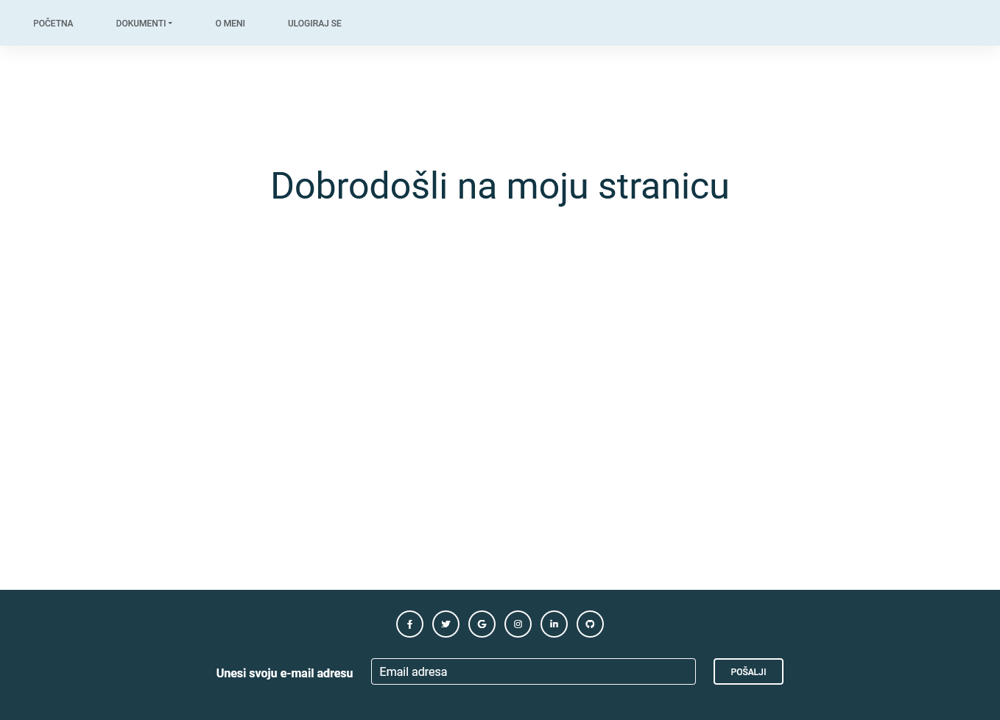
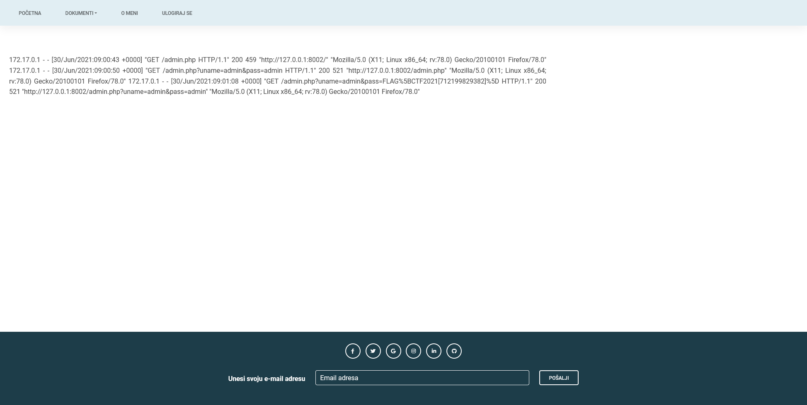

# Local Login inclusion

> Category: Web

> Points: 70

## Challenge Description

> translated: Peter was bored during summer break so he decided to make a simple website. He wasn't sure how to run his website, or where to host it, so in the end he decided to do it on his computer where his files are. Peter has a Linux computer, and he decided to host his website using Apache HTTP server. He created an account for himself as an admin, and he uses it to access the website whenever he wants to. The website isn't fully done and there are some mistakes, but Peter is proud of it, and is certain he hasn't created any flaws. Can you check and see if Peter was right?

> native: Petru je bilo dosadno tijekom ljetnih praznika pa je odlučio napraviti jednostavnu web stranicu. Nije bio siguran kako bi pokrenuo svoju stranicu i gdje bi ju posluživao, ali se na kraju odlučio za svoje računalo gdje se nalaze razne datoteke. Petar ima Linux računalo, i odlučio je posluživati svoju stranicu pomoću Apache HTTP servera. Petar je sebi napravio račun na stranici kao admin, i njime se služi kad god želi pristupiti stranici.
> Stranica nije skroz gotova i postoje neke greške, ali Petar je jako ponosan nju, i siguran je da nije napravio nikakav propust. Možeš li provjeriti i vidjeti je li Petar u pravu? 

## Analysis

Since this task explicitly says he is running an Apache HTTP server we will try to play around it.
Using BURPSuite we found that he is using an Apache 2.4.48 server.
That seems to be the latest one as of writing this, so we couldn't find any big security issues that way.

Let's look around the site a bit.

There is a documents tab too. The document one brings us to /view.php?file=dokument1.txt, which is a Lorem Ipsum txt file.

We could use this file exploring to our advantage, by attempting to read some other files. Reading a little bit into Apache it says that Debian / Ubuntu Linux Apache access log file location is /var/log/apache2/access.log

Let's try doing that but with tons of ../../../ beforehand, since we are in the website directory, and voila:

../../../../var/log/apache2/access.log seems to have done the trick! In the request we have the flag plaintext-ed.

## FLAG

> CTF2021[712199829382]