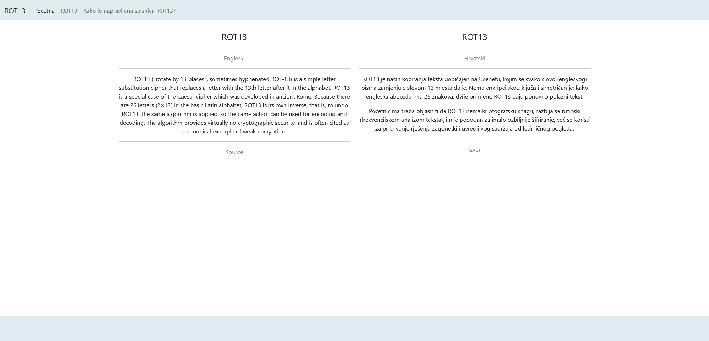
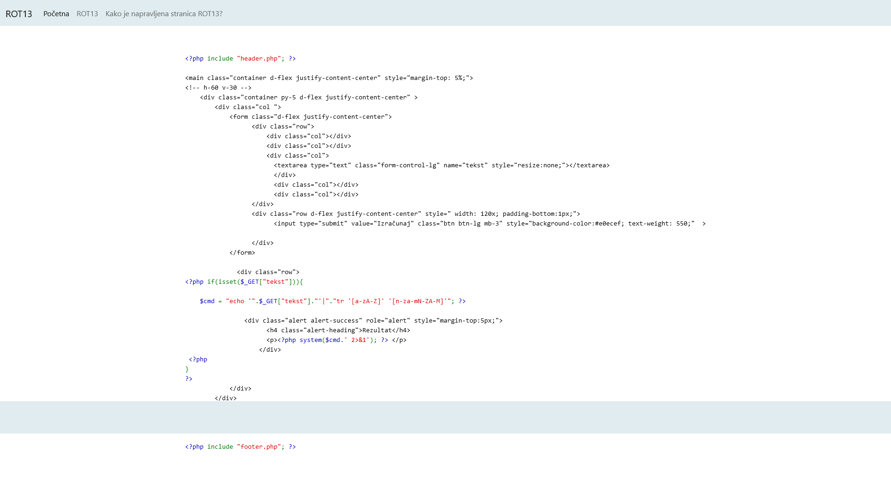
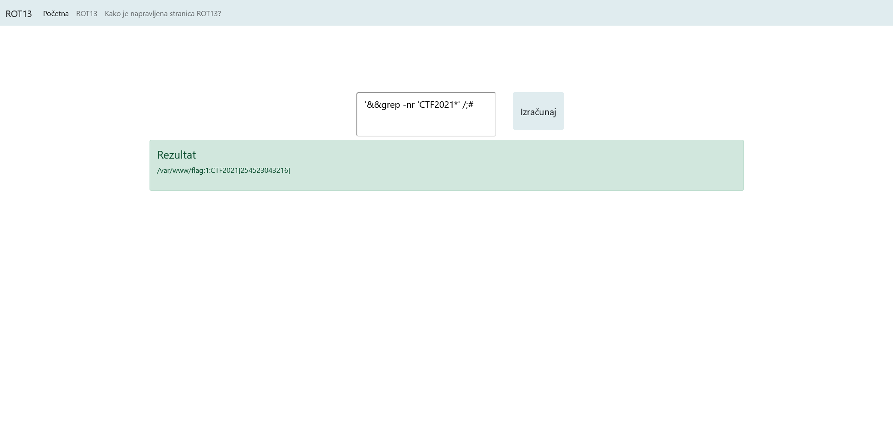

# Linux ROT13

> Category: Web

> Points: 80

## Challenge Description

> translated: Ivica loves working with Linux and is trying to use Linux commands wherever he can. Since he needed a ROT13 calculator for CTF competitions, he decided to make a website which contains the calculator done using Linux commands.

> native: Ivica obožava raditi s Linuxom i pokušava koristiti Linux naredbe gdje god može. Budući da mu je trebao ROT13 kalkulator za CTF natjecanje, odlučio je napraviti web stranicu na kojoj se nalazi ROT13 kalkulator napravljen pomoću Linux naredbi.

## Analysis

Hoping on the site we can immediately see there's a page "How was ROT13 website made".

Let's jump there.

Upon looking at the PHP we can see it executes Linux commands quite literally at will.

With some simple Linux trickery, we worked up this, and got our solution:

'&&grep -nr 'CTF2021*' /;#

## FLAG

> CTF2021[254523043216]