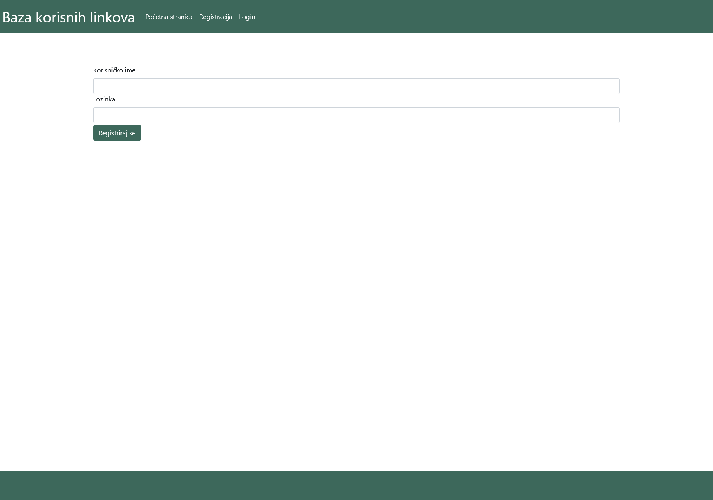
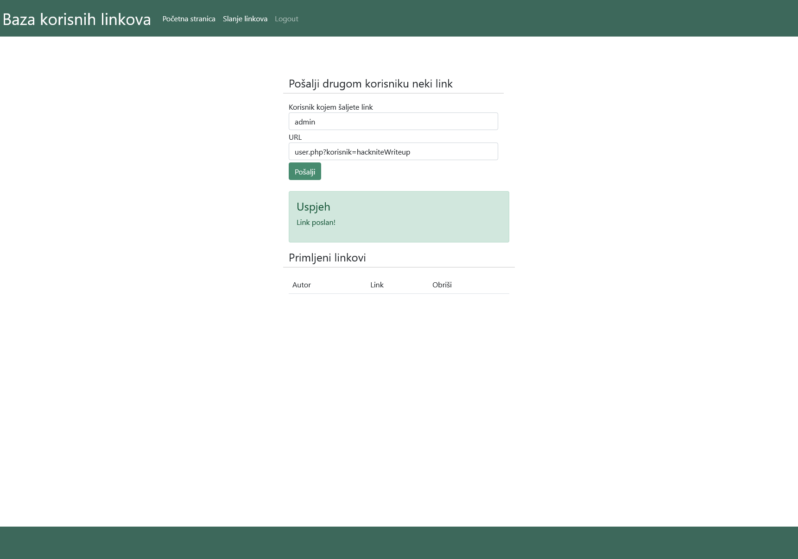
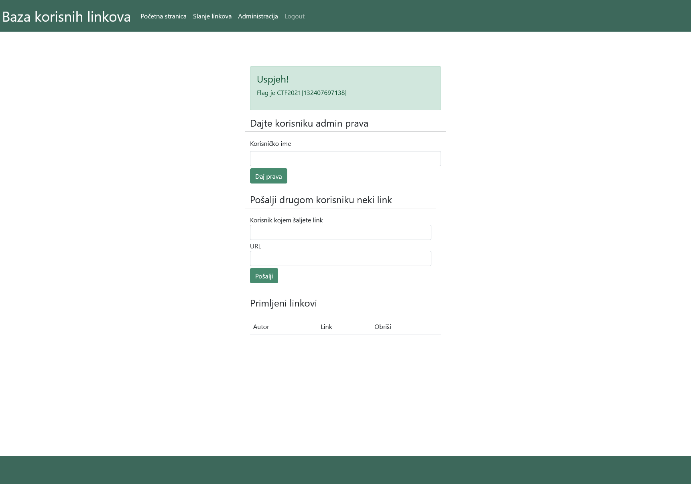

# Usable Links

> Category: Web

> Points: 150 

## Challenge Description

> translated: So that he could make learning easier to him and his friends, Mario decided to make a website for exchanging links. He and his friends can send each other links of interesting articles, tutorials and such.
> Although he trusts his friends and knows they're not ill-intented, after any of them sends a link to him, he logs in with his username "admin" and checks every sent link by clicking on it and visiting the site it enters. That can take a few seconds, since Mario likes to study the website he's on in more detail.
> With the start of the new academic year, he decided to expand the website and now even others can use it too. Mario decided to give you access to his website. He had also given you his source code which checks the links so you could see which way it really works.

> native: Kako bi olakšao učenje sebi i svojim prijateljima, Mario je odlučio napraviti stranicu za razmjenjivanje linkova. On i njegovi prijatelji si mogu slati linkove zanimljivih članaka, tutoriala ili slično.
> Iako vjeruje svojim prijateljima i zna da nisu zlonamjerni, nakon što mu netko od njih pošalje link, Mario se ulogira na stranicu svojim korisničkim imenom admin i provjeri svaki poslani link tako što ode na njega i provjeri na koju stranicu link vodi. To ipak može potrajati nekoliko sekundi, jer Mario voli detaljnije proučiti stranicu na kojoj se nalazi.
> Početkom nove akademske godine, odlučio je proširiti stranicu i sad je i drugi ljudi mogu koristiti. Mario ti je odlučio dati pristup stranici. Možeš se registrirati, ulogirati, i slati mu korisne linkove. Osim toga, odlučio ti je dati i source kod stranice na kojoj provjerava linkove tako da bi mogao vidjeti na koji on to točno način radi.

## Analysis

We are given the "user.php" source.

From the task description, every link we send to admin will be opened inside the admin account.

In the user.php, we can see if user's role is admin, it will grab a "korisnik" parameter and send a request to update some user's role in the database to admin.

Everything we have to do is to create an account (we will call ours "hackniteWriteup") and send the link "user.php?korisnik=hackniteWriteup" to user "admin".

Log out and log in, and we will see the flag.

## FLAG

> CTF2021[132407697138]